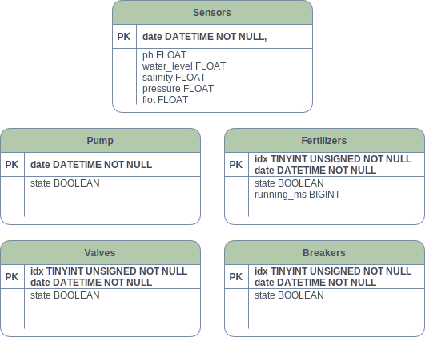

# Tipo y Servicio
## Relacional

Se ha optado por utilizar una base relacional a pesar de que no existen relaciones entre las tablas ya que estas actuan a modo de histórico.

Esta decisión se ha tomado por una cuestión de compatabilidad y robusted ya que hay mas clientes de bases de datos con más años y pruebas realizadas que las no relaciones como MongoDB.

## Mariadb

Se ha elegido MariaDB por ser la sucesora de MySql siendo este un servicio de base de datos con muchos años en el mercado y cuenta con una gran popularidad.

Además MariaDB es opensource y tiene una importante comunidad que lo soporta y cuenta con numerosas aplicaciones para su supervisión y gestión.

# Diseño

En el diseño original de la base de datos se decidió que la fecha y hora fueran la clave principal, ya que este es el campo clave en casi todos los casos o, al menos, uno de los campos principales.

El diseño final de la base de datos para las tablas que componen su clave principal con fecha/hora e indice se han tenido que modificar para adecuarse a las restricciones del framework. No obstante la identidad de estas tablas sigue siendo la combinación de estos campos.

