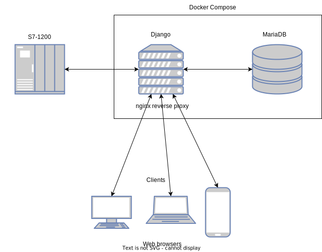

# Infraestructura



El PLC (CPU 1214 DC/DC/DC) se conecta directamente con el servidor intercambiando datos según necesidad empleando el cliente de conexión escrito en Python Snap7.

Se ha decidido utilizar el framework Django al estar basado en Python. **Django** es **SSR** (Server side rendering) pero asumimos que nuestra aplicación no va a requerir alta demanda ni demasiada interacción, por lo que esto no supone un problema.

La base de datos se ha optado por **MariaDB** por cuestiones ya explicadas en la sección de base de datos.

Django se conecta a la base de datos a través de un cliente especifico para MariaDB. Django utiliza una arquitectura para los repositorios de tipo ORM (Object-Relational Mapping).

Se planea redirigir el tráfico a través de un proxi reverso con **nginx** y enviar las peticiones al puerto en localhost que expone **Django**.

Todo esto se despliega utilizando **Docker** en un solo archivo de tipo ```docker-compose.yml``` por cuestiones de compatibilidad, comodidad y portabilidad.